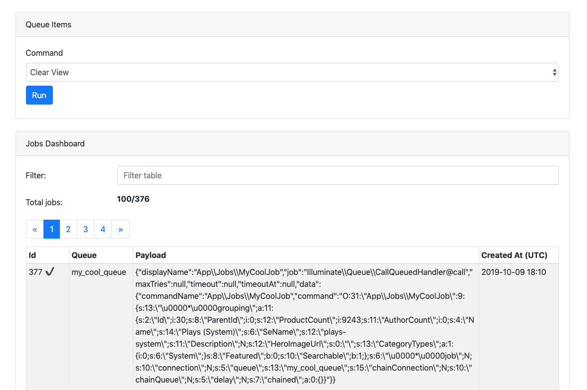

# Simple Queue View

> View the queue, baby!



## Installation

You can install the package via composer using the "VCS" link:

```bash
...
"repositories": [
    {
        "type": "vcs",
        "url": "https://github.com/enginedigital/queue-ui"
    }
],
"minimum-stability": "dev",
"require": {
    "enginedigital/queue-ui": "dev-master"
},
...
```

##### Composer Install

**TODO: publish to packagist**

##### Queue Support

**This only supports the database queue.**

## Usage

```bash
php artisan vendor:publish --tag=queue-ui-config
```

### Testing

``` bash
composer run test
```

### Changelog

Please see [CHANGELOG](CHANGELOG.md) for more information what has changed recently.

## Contributing

Please see [CONTRIBUTING](CONTRIBUTING.md) for details.

### Security

If you discover any security related issues, please email james.doyle@enginedigital.com instead of using the issue tracker.

## Credits

- [James Doyle](https://github.com/enginedigital)
- [All Contributors](../../contributors)

## License

The MIT License (MIT). Please see [License File](LICENSE.md) for more information.

## Laravel Package Boilerplate

This package was generated using the [Laravel Package Boilerplate](https://laravelpackageboilerplate.com).
